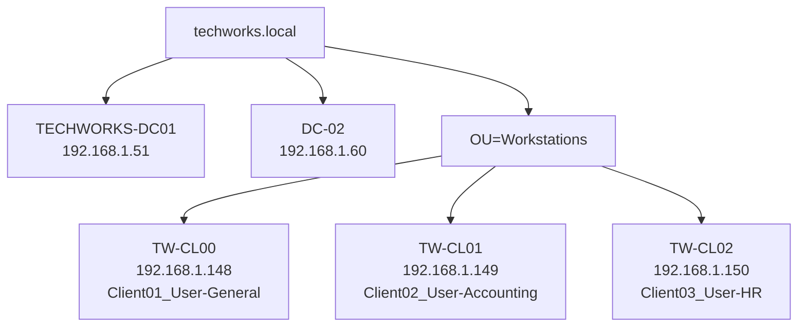
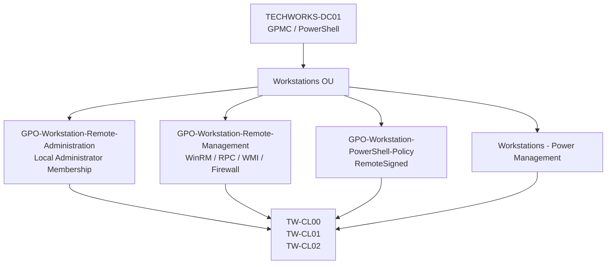
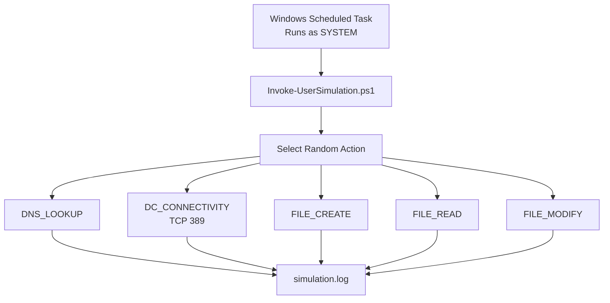
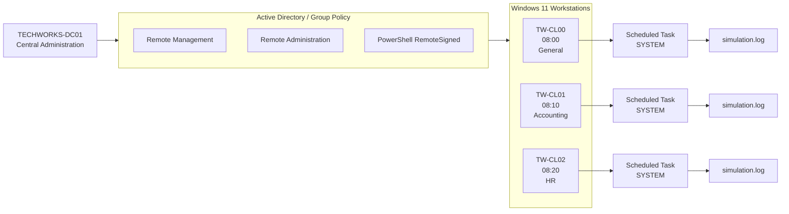

# SAM-006 — Simulating User Activity in Lab

## Synopsis

This lab implemented a centralized, automated synthetic-user workload across three Windows 11 domain-joined workstations in the `techworks.local` Active Directory environment.

The objective was to generate lightweight but recurring workstation activity that can later be used for administration, monitoring, troubleshooting, logging, Group Policy, and security exercises.

The implementation evolved beyond simple workload generation. Before reliable automation could be deployed, the environment required validation and remediation of:

- Windows Remote Management (WinRM)
- Windows Defender Firewall rules
- Group Policy processing
- Remote Scheduled Tasks/RPC
- WMI access
- PowerShell execution policy
- Existing overlapping GPOs
- Remote file deployment
- Windows Task Scheduler
- Windows time-zone configuration
- Domain time synchronization

The completed implementation runs a PowerShell workload every 15 minutes during staggered four-hour daily windows on three Windows 11 clients.

| Workstation | Synthetic Persona | Department | Window |
|---|---|---|---|
| `TW-CL00` | `Client01_User-General` | General | 08:00–12:00 |
| `TW-CL01` | `Client02_User-Accounting` | Accounting | 08:10–12:10 |
| `TW-CL02` | `Client03_User-HR` | HR | 08:20–12:20 |

Each Scheduled Task runs as `SYSTEM`. The persona names are **synthetic workload labels** and do not indicate that those Active Directory users actually authenticated or performed the logged activity.

Network shares, departmental storage, NTFS permissions, share permissions, and mapped drives are intentionally deferred to **SAM-007**.

---

# 1. Objectives

The primary objectives of SAM-006 were to:

1. Create realistic lightweight activity on otherwise idle Windows lab clients.
2. Limit workload generation to approximately four hours per day.
3. Stagger activity between clients to avoid simultaneous bursts.
4. Centrally deploy and manage the simulation.
5. Generate repeatable activity useful for later monitoring and troubleshooting.
6. Validate remote Windows administration capabilities.
7. Preserve activity history in dedicated logs.
8. Establish infrastructure that can later interact with network resources introduced in SAM-007.

A secondary objective emerged during implementation: establish a reliable centralized Windows-management foundation rather than manually administering each workstation.

---

# 2. Environment

## Active Directory

```text
Domain: techworks.local

Domain Controllers:
TECHWORKS-DC01    192.168.1.51
DC-02             192.168.1.60
```

Primary administration during this lab was performed from `TECHWORKS-DC01`.

## Windows Clients

```text
TW-CL00    192.168.1.148
TW-CL01    192.168.1.149
TW-CL02    192.168.1.150
```

All three systems are Windows 11 Pro domain members located under the Workstations OU.

## Synthetic Personas

The simulation associates each workstation with an intended persona:

```text
TW-CL00 -> Client01_User-General
TW-CL01 -> Client02_User-Accounting
TW-CL02 -> Client03_User-HR
```

Corresponding Active Directory users exist:

```text
Client01_User
Client02_User
Client03_User
```

`Client02_User` belongs to the Accounting security group and `Client03_User` belongs to the HR security group.

### Important distinction

The current simulation runs through Windows Scheduled Tasks using:

```text
NT AUTHORITY\SYSTEM
```

Therefore:

> The simulation does not currently represent an interactive logon by the corresponding AD user.

The persona stored in `simulation.log` identifies the workload profile being simulated, not the Windows security principal executing the process.

This distinction becomes particularly important when reviewing security logs or testing user-specific permissions.

---

# 3. Architecture

## Domain and Workstation Topology



---

# 4. Centralized Management Architecture

Reliable remote administration became a prerequisite for the workload deployment.

The final management model uses several separate GPOs rather than one monolithic policy.



This separation provides clearer policy ownership:

| GPO | Responsibility |
|---|---|
| `GPO-Workstation-Remote-Administration` | Determines who receives local administrative access |
| `GPO-Workstation-Remote-Management` | Enables infrastructure required for remote management |
| `GPO-Workstation-PowerShell-Policy` | Controls workstation PowerShell script execution |
| `Workstations - Power Management` | Controls workstation power behavior |

---

# 5. Initial Remote-Management Problem

Before the simulation could be centrally deployed, the Windows clients had to be remotely manageable.

DNS resolution succeeded, but remote connectivity did not.

Testing revealed failures involving:

- ICMP
- TCP 5985
- TCP 445
- WinRM
- Remote Scheduled Tasks

A key discovery was that viewing only locally configured Windows Firewall rules did not necessarily show the policy actually being enforced.

The effective rules were inspected using:

```powershell
Get-NetFirewallRule -PolicyStore ActiveStore
```

This exposed firewall configuration delivered through Group Policy.

## Lesson

The local firewall configuration and the **effective firewall policy** are not necessarily the same thing.

When troubleshooting domain-managed endpoints, the `ActiveStore` is often more relevant because it represents the currently effective firewall policy.

---

# 6. WinRM Configuration

WinRM was initially stopped on at least one workstation.

The remote-management GPO was configured to provide the required infrastructure, including:

- WinRM service startup
- TCP 5985 access
- Remote Scheduled Tasks RPC
- RPC Endpoint Mapper
- WMI/DCOM
- WMI asynchronous access

The firewall configuration was intentionally scoped rather than disabling Windows Firewall.

The WinRM rule allowed:

```text
Profile:        Domain
Protocol:       TCP
Port:           5985
Remote scope:   LocalSubnet
```

This followed a least-exposure approach instead of opening management services indiscriminately.

---

# 7. Group Policy Processing Problem

Group Policy Management reported that remote Group Policy update operations completed successfully.

However, endpoint verification showed that not every client had actually processed the new policy.

For example, `TW-CL01` still showed older policy results.

Targeted policy updates were then issued:

```powershell
Invoke-GPUpdate -Computer TW-CL01 -Target Computer -Force -RandomDelayInMinutes 0
Invoke-GPUpdate -Computer TW-CL02 -Target Computer -Force -RandomDelayInMinutes 0
```

After processing completed, WinRM validation succeeded:

```powershell
Test-WSMan TW-CL00
Test-WSMan TW-CL01
Test-WSMan TW-CL02
```

Remote CIM queries also succeeded.

```powershell
Get-CimInstance Win32_ComputerSystem -ComputerName TW-CL00,TW-CL01,TW-CL02 |
    Select-Object PSComputerName, Name, UserName
```

## Lesson

A successful remote GPUpdate request does **not necessarily prove that the endpoint has already processed and applied the desired policy**.

Always verify endpoint state.

---

# 8. Existing GPO Review and Consolidation

During troubleshooting, existing workstation GPOs were reviewed.

Three remote-management-related policies were identified.

## Remote Administration GPO

Original name:

```text
GPO-Workstation-Remote-Adminstration
```

The name contained a spelling error.

The GPO used Group Policy Preferences Local Users and Groups to add:

```text
TECHWORKS\Workstation-Admins
```

to the local Administrators group.

It was renamed:

```text
GPO-Workstation-Remote-Administration
```

---

## Remote Management GPO

Original name:

```text
GPO-Workstation-Remote-Management-Firewall
```

Inspection showed that the policy did considerably more than configure a firewall.

It included:

- WinRM
- Remote Scheduled Tasks RPC
- RPC Endpoint Mapper
- WMI
- DCOM

It was therefore renamed:

```text
GPO-Workstation-Remote-Management
```

---

## Redundant Remote Management GPO

Another GPO existed:

```text
Techworks - Workstation Remote Management
```

It contained overlapping WinRM configuration introduced while troubleshooting SAM-006.

Instead of maintaining duplicate configuration:

1. Required WinRM configuration was consolidated into `GPO-Workstation-Remote-Management`.
2. The redundant GPO link was disabled.
3. Workstations were refreshed.
4. WinRM and CIM were tested.
5. The redundant GPO was deleted only after validation succeeded.

This followed a safer change-control pattern:

```text
Consolidate
    ↓
Disable
    ↓
Refresh
    ↓
Validate
    ↓
Delete
```

## Final Workstations OU GPO Links

```text
GPO-Workstation-Remote-Administration
Workstations - Power Management
GPO-Workstation-Remote-Management
GPO-Workstation-PowerShell-Policy
```

The inheritance state was inspected with:

```powershell
Get-GPInheritance -Target "OU=Workstations,DC=techworks,DC=local" |
    Select-Object -ExpandProperty GpoLinks |
    Select-Object DisplayName, Enabled, Enforced, Order
```

---

# 9. PowerShell Execution Policy

After deploying the initial simulation script to `TW-CL00`, script execution failed because PowerShell script execution was disabled.

The workstation reported:

```text
MachinePolicy : Undefined
UserPolicy    : Undefined
Process       : Undefined
CurrentUser   : Undefined
LocalMachine  : Undefined
```

Instead of using `Unrestricted` or permanently bypassing execution policy, a dedicated GPO was created:

```text
GPO-Workstation-PowerShell-Policy
```

Configuration:

```text
Computer Configuration
  > Policies
    > Administrative Templates
      > Windows Components
        > Windows PowerShell
          > Turn on Script Execution
```

Configured as:

```text
Enabled
Allow local scripts and remote signed scripts
```

This resulted in:

```text
MachinePolicy : RemoteSigned
```

## Why `RemoteSigned`?

`RemoteSigned` provided a better balance than `Unrestricted`.

Locally created scripts can execute, while scripts identified as originating remotely require a trusted signature unless appropriately unblocked.

The policy also keeps script-execution control centralized through Active Directory.

---

# 10. Simulation Directory

Each workstation uses:

```text
C:\TechWorks\UserSimulation\
```

with the following structure:

```text
C:\TechWorks\UserSimulation\
│
├── Invoke-UserSimulation.ps1
├── simulation.log
│
└── Activity\
```

The `Activity` directory contains files created and modified by the simulation.

---

# 11. Synthetic Workload

The PowerShell script randomly chooses one of several actions each time it executes.

Current operations include:

```text
DNS_LOOKUP
DC_CONNECTIVITY
FILE_CREATE
FILE_READ
FILE_MODIFY
```

## DNS Lookup

Performs DNS resolution for:

```text
techworks.local
```

using:

```powershell
Resolve-DnsName "techworks.local"
```

---

## Domain Controller Connectivity

Tests TCP connectivity to LDAP on:

```text
TECHWORKS-DC01:389
```

using:

```powershell
Test-NetConnection "TECHWORKS-DC01" -Port 389
```

---

## File Creation

Creates timestamped synthetic work files such as:

```text
work-20260925-172320.txt
```

---

## File Read

Randomly selects an existing activity file and reads its contents.

---

## File Modification

Randomly selects an existing activity file and appends a modification timestamp.

---

# 12. Logging

Each operation writes to:

```text
C:\TechWorks\UserSimulation\simulation.log
```

Example:

```text
2026-09-25 17:42:09 | TW-CL01 | Client02_User-Accounting | DNS_LOOKUP | SUCCESS
```

The format is:

```text
TIMESTAMP | COMPUTER | SYNTHETIC PERSONA | ACTION | RESULT
```

Errors are also captured rather than terminating the simulation without evidence.

Example:

```text
TW-CL01 | Client02_User-Accounting | FILE_MODIFY | FAILED: No activity file available to modify.
```

This was an expected controlled failure because `FILE_MODIFY` was randomly selected before the workstation had any files available to modify.

That behavior was retained intentionally.

---

# 13. Simulation Workflow



The resulting workload provides activity that can later be observed through:

- Windows event logs
- DNS
- network monitoring
- file activity
- domain-controller connectivity
- Scheduled Task history
- future SMB access
- future security monitoring

---

# 14. Deployment Strategy

`TW-CL00` was used as the initial canary.

After successful testing there, the known-good script was retrieved remotely:

```powershell
$Script = Invoke-Command -ComputerName TW-CL00 -ScriptBlock {
    Get-Content "C:\TechWorks\UserSimulation\Invoke-UserSimulation.ps1" -Raw
}
```

The script was then deployed to `TW-CL01` and `TW-CL02`:

```powershell
Invoke-Command -ComputerName TW-CL01,TW-CL02 -ScriptBlock {
    New-Item -Path "C:\TechWorks\UserSimulation\Activity" `
        -ItemType Directory -Force | Out-Null

    Set-Content `
        -Path "C:\TechWorks\UserSimulation\Invoke-UserSimulation.ps1" `
        -Value $using:Script `
        -Encoding UTF8
}
```

The persona string was then changed appropriately on each workstation.

---

# 15. Deployment Verification Failure

An earlier deployment attempt did not actually place the expected files on `TW-CL01` and `TW-CL02`.

Instead of assuming deployment succeeded, endpoint state was queried:

```powershell
Invoke-Command -ComputerName TW-CL00,TW-CL01,TW-CL02 -ScriptBlock {
    [PSCustomObject]@{
        Computer      = $env:COMPUTERNAME
        BaseDirectory = Test-Path "C:\TechWorks\UserSimulation"
        ActivityDir   = Test-Path "C:\TechWorks\UserSimulation\Activity"
        Script        = Test-Path "C:\TechWorks\UserSimulation\Invoke-UserSimulation.ps1"
    }
}
```

Results showed:

```text
TW-CL00    present
TW-CL01    absent
TW-CL02    absent
```

The deployment process was corrected and repeated.

## Lesson

A command being issued successfully is not equivalent to the intended state existing on the endpoint.

Deployment should be followed by explicit state verification.

---

# 16. Windows PowerShell 5.1 Compatibility Issue

During deployment, commands were initially chained using:

```text
&&
```

The management environment was running Windows PowerShell 5.1.

Unlike modern PowerShell versions, Windows PowerShell 5.1 does not support `&&` as a pipeline-chain operator.

The commands therefore had to be structured using syntax compatible with Windows PowerShell 5.1.

## Lesson

Before writing administrative automation, verify the shell version being used.

Syntax that works in PowerShell 7 is not necessarily compatible with Windows PowerShell 5.1.

---

# 17. Multi-Computer Output

When using:

```powershell
Invoke-Command -ComputerName TW-CL01,TW-CL02
```

plain text output from multiple computers could become difficult to associate reliably with its source.

Structured output was therefore preferred:

```powershell
[PSCustomObject]@{
    Computer = $env:COMPUTERNAME
    ...
}
```

PowerShell remoting additionally provides:

```text
PSComputerName
RunspaceId
```

## Lesson

When querying multiple systems, return structured objects containing an explicit computer identity rather than relying on output ordering.

---

# 18. Scheduled Task Design

The simulation was designed to consume minimal lab resources.

Rather than maintaining a PowerShell process for four hours, Task Scheduler launches the script periodically.

The final schedule is:

```text
TW-CL00
08:00–12:00
Every 15 minutes

TW-CL01
08:10–12:10
Every 15 minutes

TW-CL02
08:20–12:20
Every 15 minutes
```

The staggered schedule reduces simultaneous workload bursts.

---

# 19. Scheduled Task Repetition Problem

The first ScheduledTasks-module implementation attempted to modify:

```powershell
$Trigger.Repetition.Interval
$Trigger.Repetition.Duration
```

On `TW-CL01`, PowerShell returned:

```text
The property 'Interval' cannot be found on this object.
The property 'Duration' cannot be found on this object.
```

However, those errors were non-terminating.

PowerShell continued executing and subsequently registered the Scheduled Task.

This created a dangerous partial-success condition:

```text
Trigger creation     succeeded
Repetition settings  failed
Task registration    succeeded
```

Instead of immediately changing more systems, deployment stopped and the actual task configuration was inspected.

## Lesson

A PowerShell command block can generate errors and still execute later statements.

Therefore:

> Successful execution of the final statement does not prove that every earlier statement succeeded.

Inspect resulting state before continuing deployment.

---

# 20. Switching to SCHTASKS.EXE

Because the ScheduledTasks object did not expose the expected repetition properties in this environment, `schtasks.exe` was used instead.

For `TW-CL01`:

```powershell
schtasks.exe /Create `
    /TN "TechWorks-UserSimulation" `
    /TR 'powershell.exe -NoProfile -File "C:\TechWorks\UserSimulation\Invoke-UserSimulation.ps1"' `
    /SC DAILY `
    /ST 08:10 `
    /RI 15 `
    /DU 04:00 `
    /RU SYSTEM `
    /RL HIGHEST `
    /F
```

Verification showed:

```text
Schedule Type:                   Daily
Start Time:                      8:10:00 AM
Repeat: Every:                   0 Hour(s), 15 Minute(s)
Repeat: Until: Duration:         4 Hour(s), 0 Minute(s)
Run As User:                     SYSTEM
```

A manual execution then returned:

```text
LastTaskResult : 0
```

with:

```text
Client02_User-Accounting | DNS_LOOKUP | SUCCESS
```

The validated method was then used for `TW-CL02`.

---

# 21. Task Result vs. Workload Result

An important distinction was identified during testing.

Windows Task Scheduler may report:

```text
LastTaskResult : 0
```

while the simulation log records:

```text
FILE_MODIFY | FAILED: No activity file available to modify.
```

These statements are not contradictory.

`LastTaskResult = 0` means the PowerShell process executed successfully from Task Scheduler's perspective.

The simulation itself caught and logged an internal workload condition.

This distinction is valuable when troubleshooting automation:

```text
Automation execution status
            !=
Application/workload operation status
```

Both layers should be monitored.

---

# 22. TW-CL02 Time Anomaly

During final validation, `TW-CL02` produced:

```text
LastRunTime : 5:43 PM
```

while its local simulation log contained:

```text
14:43
```

The Scheduled Task also initially appeared to have a next execution time three hours later than expected.

The discrepancy was exactly three hours.

Time configuration was inspected remotely:

```powershell
Invoke-Command -ComputerName TW-CL00,TW-CL01,TW-CL02 -ScriptBlock {
    [PSCustomObject]@{
        Computer      = $env:COMPUTERNAME
        LocalTime     = Get-Date
        TimeZone      = (Get-TimeZone).Id
        W32TimeStatus = (Get-Service W32Time).Status
    }
}
```

Results:

```text
TW-CL00    Eastern Standard Time
TW-CL01    Eastern Standard Time
TW-CL02    Pacific Standard Time
```

The Windows Time service was running on all systems.

---

# 23. Domain Time Synchronization Verification

Windows Time was queried:

```powershell
w32tm /query /source
w32tm /query /status
```

The clients reported domain controllers as their time sources.

Observed sources included:

```text
TW-CL00 -> Techworks-DC01.techworks.local
TW-CL01 -> DC-02.techworks.local
TW-CL02 -> Techworks-DC01.techworks.local
```

This demonstrated an important distinction:

> Time synchronization and time-zone configuration are separate mechanisms.

`TW-CL02` was synchronizing successfully with the domain while still displaying the wrong local time because it was configured for Pacific Time.

---

# 24. Remote Time-Zone Remediation

There was no need to log into `TW-CL02` interactively.

The time zone was corrected remotely:

```powershell
Invoke-Command -ComputerName TW-CL02 -ScriptBlock {
    Set-TimeZone -Id "Eastern Standard Time"
}
```

This changed the workstation from:

```text
Pacific Standard Time
```

to:

```text
Eastern Standard Time
```

without requiring an RDP session or manual Settings interaction.

This is a particularly useful operational technique for remote-support environments.

After correction, the Scheduled Task reported:

```text
Next Run Time:    9/26/2026 8:20:00 AM
Status:           Ready
Last Result:      0
Start Time:       8:20:00 AM
Repeat:           Every 15 minutes
Duration:         4 hours
Run As User:      SYSTEM
```

The task did not need to be rebuilt.

---

# 25. Final Validation

Centralized validation was performed using:

```powershell
Invoke-Command -ComputerName TW-CL00,TW-CL01,TW-CL02 -ScriptBlock {
    $Task = Get-ScheduledTask -TaskName "TechWorks-UserSimulation"
    $Info = Get-ScheduledTaskInfo -TaskName "TechWorks-UserSimulation"

    [PSCustomObject]@{
        Computer       = $env:COMPUTERNAME
        TaskState      = $Task.State
        LastRunTime    = $Info.LastRunTime
        LastTaskResult = $Info.LastTaskResult
        NextRunTime    = $Info.NextRunTime
        LastActivity   = Get-Content "C:\TechWorks\UserSimulation\simulation.log" -Tail 1
    }
}
```

Final status:

```text
TW-CL00
State:           Ready
LastTaskResult:  0
Next Run:        08:00
Persona:         Client01_User-General

TW-CL01
State:           Ready
LastTaskResult:  0
Next Run:        08:10
Persona:         Client02_User-Accounting

TW-CL02
State:           Ready
LastTaskResult:  0
Next Run:        08:20
Persona:         Client03_User-HR
```

---

# 26. Final Architecture



---

# 27. Problems Encountered and Resolutions

| Problem | Cause | Resolution |
|---|---|---|
| DNS worked but remote management failed | Name resolution alone did not establish service reachability | Tested specific management ports and services |
| Firewall rules appeared disabled | Local rule view did not represent effective GPO policy | Inspected `ActiveStore` |
| WinRM unavailable | Service/firewall infrastructure incomplete | Configured through remote-management GPO |
| GPUpdate appeared successful but policy absent | Remote request did not prove endpoint processing | Used targeted `Invoke-GPUpdate` and endpoint verification |
| Duplicate GPO configuration | Troubleshooting introduced overlapping policy | Consolidated, disabled, validated, then deleted redundant GPO |
| `.ps1` execution blocked | Workstations lacked appropriate execution policy | Deployed `RemoteSigned` through GPO |
| CL01/CL02 initially rejected scripts | New GPO had not yet processed | Forced policy update and verified |
| Script missing from CL01/CL02 | Initial deployment did not produce expected endpoint state | Verified with `Test-Path`, then redeployed |
| `&&` failed | DC01 used Windows PowerShell 5.1 | Used PowerShell 5.1-compatible syntax |
| Multi-host output difficult to associate | Concurrent remoting output interleaved | Returned structured objects containing computer names |
| FILE_MODIFY failed | No activity file existed yet | Error handled and logged; behavior retained |
| Scheduled Task repetition properties failed | Trigger object did not expose expected writable properties | Used `schtasks.exe` |
| Task still registered after repetition errors | PowerShell errors were non-terminating | Inspected actual state before remediation |
| CL02 logs three hours behind | Workstation configured for Pacific Time | Remotely changed to Eastern using `Set-TimeZone` |
| Concern about domain clock synchronization | Time-zone problem resembled clock problem | Verified `w32tm` source/status separately |

---

# 28. Achievements

SAM-006 established more than synthetic activity.

The lab demonstrated:

- Central Windows workstation administration
- WinRM deployment and validation
- Effective firewall-policy troubleshooting
- WMI/CIM remote management
- Remote Scheduled Tasks infrastructure
- Group Policy troubleshooting
- GPO consolidation and cleanup
- PowerShell execution-policy management
- Remote script deployment
- Multi-system validation
- Scheduled Task automation
- PowerShell 5.1 compatibility awareness
- Structured remote output
- Controlled error logging
- Remote time-zone remediation
- Active Directory time-source validation
- Canary-first deployment methodology

The resulting environment is substantially easier to administer centrally than at the beginning of the lab.

---

# 29. Lessons Learned

## DNS success does not prove service connectivity

A hostname resolving successfully only establishes DNS resolution.

A service still needs to be:

- running,
- listening,
- reachable through the firewall,
- correctly configured.

---

## Firewall allow does not mean service available

Opening TCP 5985 does not make WinRM functional if WinRM itself is stopped.

Firewall and service state must be tested separately.

---

## Inspect effective policy

In a domain environment, local configuration may not represent the actual effective configuration.

For Windows Firewall, `ActiveStore` was particularly useful.

---

## Trust endpoint state, not only management-console status

A management system reporting that an operation was initiated successfully does not prove the endpoint reached the desired state.

Verification should be part of every deployment.

---

## Separate GPO responsibilities

Dedicated GPOs make configuration easier to understand and troubleshoot.

The final design separates:

```text
Administrative membership
Remote-management infrastructure
PowerShell execution policy
Power management
```

---

## Disable before deleting

When removing redundant infrastructure:

```text
Disable
Refresh
Test
Delete
```

is safer than immediate deletion.

---

## Know the shell version

Windows PowerShell 5.1 and PowerShell 7 are not syntactically identical.

Administrative scripts must account for the environment in which they execute.

---

## Structured output scales better

When managing several systems simultaneously, `[PSCustomObject]` output is substantially easier to interpret than unstructured text.

---

## Automation success and workload success are separate

A scheduler can successfully execute a script that encounters an application-level condition.

Both layers need their own status information.

---

## Time zone and time synchronization are different

A domain workstation can be correctly synchronized to a domain controller while displaying the wrong local time.

The CL02 issue demonstrated this directly:

```text
Windows Time:       Healthy
Domain time source: Healthy
Time zone:          Incorrect
```

---

## Remote administration can eliminate unnecessary interactive sessions

A setting that would traditionally require logging into a workstation can often be changed centrally.

For example:

```powershell
Set-TimeZone -Id "Eastern Standard Time"
```

can correct a remote workstation without opening Settings or establishing an interactive desktop session.

---

# 30. Deferred to SAM-007

SAM-006 intentionally does **not** implement network storage.

SAM-007 should introduce:

- File-server/storage architecture
- Accounting departmental share
- HR departmental share
- AD security-group-based authorization
- SMB share permissions
- NTFS permissions
- GPO drive mapping
- Authorized-access testing
- Unauthorized-access testing

Once those resources exist, SAM-006 can be extended so the synthetic personas generate controlled SMB and departmental file activity.

---

# Command Reference

## `Invoke-Command`

```powershell
Invoke-Command -ComputerName TW-CL02 -ScriptBlock {
    Get-TimeZone
}
```

### Purpose

Executes PowerShell commands on a remote Windows computer using PowerShell remoting.

### Important parameters

`-ComputerName`

Specifies the remote endpoint.

`-ScriptBlock`

Contains the PowerShell commands that execute remotely.

### Why used

This was the primary centralized administration mechanism for SAM-006.

---

## `Test-WSMan`

```powershell
Test-WSMan TW-CL00
```

### Purpose

Tests whether the Windows Remote Management service responds on the target computer.

### Why used

Validated WinRM after Group Policy and firewall changes.

---

## `Get-CimInstance`

```powershell
Get-CimInstance Win32_ComputerSystem -ComputerName TW-CL00,TW-CL01,TW-CL02
```

### Purpose

Retrieves CIM/WMI management information from remote computers.

### Why used

Verified that centralized management extended beyond basic WinRM connectivity.

---

## `Test-NetConnection`

```powershell
Test-NetConnection TECHWORKS-DC01 -Port 389
```

### Purpose

Tests network connectivity to a specific TCP port.

### Important parameter

`-Port 389`

Tests LDAP connectivity rather than merely ICMP reachability.

### Why used

Generated synthetic domain-controller activity and validated application-layer network reachability.

---

## `Resolve-DnsName`

```powershell
Resolve-DnsName techworks.local
```

### Purpose

Queries DNS for the specified hostname/domain.

### Why used

Provides lightweight synthetic DNS activity and confirms domain DNS resolution.

---

## `Get-NetFirewallRule`

```powershell
Get-NetFirewallRule -PolicyStore ActiveStore
```

### Purpose

Retrieves Windows Defender Firewall rules.

### Important parameter

`-PolicyStore ActiveStore`

Queries the effective currently active firewall policy rather than only one underlying configuration source.

### Why used

Helped identify GPO-delivered firewall configuration that was not obvious from the local rule view.

---

## `Invoke-GPUpdate`

```powershell
Invoke-GPUpdate `
    -Computer TW-CL01 `
    -Target Computer `
    -Force `
    -RandomDelayInMinutes 0
```

### Purpose

Initiates Group Policy refresh on a remote computer.

### Important parameters

`-Computer`

Specifies the target workstation.

`-Target Computer`

Refreshes computer policy.

`-Force`

Reapplies policy settings.

`-RandomDelayInMinutes 0`

Removes the normal randomized delay, useful for deterministic lab troubleshooting.

### Why used

Forced clients to process newly configured workstation policies during testing.

---

## `Get-GPInheritance`

```powershell
Get-GPInheritance -Target "OU=Workstations,DC=techworks,DC=local"
```

### Purpose

Retrieves Group Policy inheritance information for an AD container.

### Why used

Verified the final GPO links affecting the Workstations OU.

---

## `Get-ExecutionPolicy`

```powershell
Get-ExecutionPolicy -List
```

### Purpose

Displays PowerShell execution policy at every scope.

### Why used

Diagnosed why the simulation `.ps1` file could not initially execute.

---

## `New-Item`

```powershell
New-Item `
    -Path "C:\TechWorks\UserSimulation\Activity" `
    -ItemType Directory `
    -Force
```

### Purpose

Creates files or directories.

### Important parameters

`-ItemType Directory`

Creates a directory.

`-Force`

Allows creation without failing when appropriate existing path components are present.

### Why used

Created the workstation simulation directory structure.

---

## `Get-Content`

```powershell
Get-Content "C:\TechWorks\UserSimulation\Invoke-UserSimulation.ps1" -Raw
```

### Purpose

Reads file contents.

### Important parameter

`-Raw`

Returns the complete file as one string rather than an array of individual lines.

### Why used

Retrieved the validated CL00 simulation script for centralized deployment.

---

## `Set-Content`

```powershell
Set-Content `
    -Path "C:\TechWorks\UserSimulation\Invoke-UserSimulation.ps1" `
    -Value $using:Script `
    -Encoding UTF8
```

### Purpose

Writes content to a file.

### Important parameter

`-Encoding UTF8`

Specifies UTF-8 output.

### Why used

Deployed the known-good simulation script onto remote clients.

---

## `$using:`

```powershell
$using:Script
```

### Purpose

Makes a variable from the caller's local session available inside a remote PowerShell script block.

### Why used

Allowed the script retrieved from CL00 to be written to CL01 and CL02 through PowerShell remoting.

---

## `Test-Path`

```powershell
Test-Path "C:\TechWorks\UserSimulation\Invoke-UserSimulation.ps1"
```

### Purpose

Determines whether a specified filesystem path exists.

### Why used

Verified that deployment actually produced the required directories and script files.

---

## `Get-Random`

```powershell
Get-Random -InputObject $Actions
```

### Purpose

Randomly selects an item from a collection.

### Why used

Selects a synthetic activity type on each simulation execution.

---

## `Add-Content`

```powershell
Add-Content -Path $LogFile
```

### Purpose

Appends content without replacing existing file contents.

### Why used

Maintains cumulative simulation history and modifies synthetic work files.

---

## `Get-ScheduledTask`

```powershell
Get-ScheduledTask -TaskName "TechWorks-UserSimulation"
```

### Purpose

Retrieves a Windows Scheduled Task definition.

### Why used

Validated task existence and state.

---

## `Get-ScheduledTaskInfo`

```powershell
Get-ScheduledTaskInfo -TaskName "TechWorks-UserSimulation"
```

### Purpose

Retrieves runtime information about a Scheduled Task.

### Useful properties

```text
LastRunTime
LastTaskResult
NextRunTime
```

### Why used

Verified that the simulation task actually executed successfully.

---

## `Start-ScheduledTask`

```powershell
Start-ScheduledTask -TaskName "TechWorks-UserSimulation"
```

### Purpose

Starts an existing Scheduled Task immediately.

### Why used

Allowed testing without waiting until the next scheduled execution.

---

## `schtasks.exe /Create`

```powershell
schtasks.exe /Create `
    /TN "TechWorks-UserSimulation" `
    /TR 'powershell.exe -NoProfile -File "C:\TechWorks\UserSimulation\Invoke-UserSimulation.ps1"' `
    /SC DAILY `
    /ST 08:10 `
    /RI 15 `
    /DU 04:00 `
    /RU SYSTEM `
    /RL HIGHEST `
    /F
```

### Purpose

Creates or replaces a Windows Scheduled Task.

### Important switches

`/TN`

Specifies the task name.

`/TR`

Specifies the command executed by the task.

`/SC DAILY`

Sets a daily schedule.

`/ST 08:10`

Sets the daily starting time.

`/RI 15`

Repeats the task every 15 minutes.

`/DU 04:00`

Limits the repetition window to four hours.

`/RU SYSTEM`

Executes the task using the local SYSTEM account.

`/RL HIGHEST`

Uses the highest available run level.

`/F`

Forces replacement of an existing task when necessary.

### Why used

Provided reliable Scheduled Task repetition configuration after the ScheduledTasks PowerShell object did not expose the expected writable repetition properties.

---

## `schtasks.exe /Query`

```powershell
schtasks.exe /Query `
    /TN "TechWorks-UserSimulation" `
    /V `
    /FO LIST
```

### Purpose

Displays Scheduled Task configuration.

### Important switches

`/TN`

Specifies the task.

`/V`

Requests verbose information.

`/FO LIST`

Displays output in list format.

### Why used

Verified the actual stored start time, repetition interval, duration, account, action, and next run time.

---

## `schtasks.exe /Run`

```powershell
schtasks.exe /Run /TN "TechWorks-UserSimulation"
```

### Purpose

Immediately starts an existing Scheduled Task.

### Why used

Validated the complete Task Scheduler → PowerShell → simulation → logging workflow.

---

## `schtasks.exe /Delete`

```powershell
schtasks.exe /Delete `
    /TN "TechWorks-UserSimulation" `
    /F
```

### Purpose

Deletes a Scheduled Task.

### Important switch

`/F`

Suppresses confirmation.

### Why used

Removed the partially configured CL01 task before recreating it with the validated scheduling method.

---

## `Get-TimeZone`

```powershell
Get-TimeZone
```

### Purpose

Returns the Windows time-zone configuration.

### Why used

Identified that `TW-CL02` was configured for Pacific Time while the other workstations used Eastern Time.

---

## `Set-TimeZone`

```powershell
Set-TimeZone -Id "Eastern Standard Time"
```

### Purpose

Changes the Windows system time zone.

### Important parameter

`-Id`

Specifies the Windows time-zone identifier.

### Why used

Remotely corrected `TW-CL02` from Pacific to Eastern Time without requiring an interactive login or RDP session.

---

## `Get-Service`

```powershell
Get-Service W32Time
```

### Purpose

Retrieves the state of a Windows service.

### Why used

Confirmed that Windows Time was running on each workstation.

---

## `w32tm /query /source`

```powershell
w32tm /query /source
```

### Purpose

Displays the computer's current Windows Time synchronization source.

### Why used

Confirmed that clients were obtaining time from domain controllers.

Observed examples:

```text
Techworks-DC01.techworks.local
DC-02.techworks.local
```

---

## `w32tm /query /status`

```powershell
w32tm /query /status
```

### Purpose

Displays detailed Windows Time synchronization status.

### Why used

Confirmed that CL02's three-hour discrepancy was a time-zone problem rather than failure to synchronize with Active Directory.

---

# Final Status

**SAM-006: COMPLETE**

The TechWorks lab now contains three centrally manageable Windows clients producing staggered synthetic activity during controlled daily windows.

The lab also established the remote-management foundation required for increasingly realistic Windows administration exercises.

